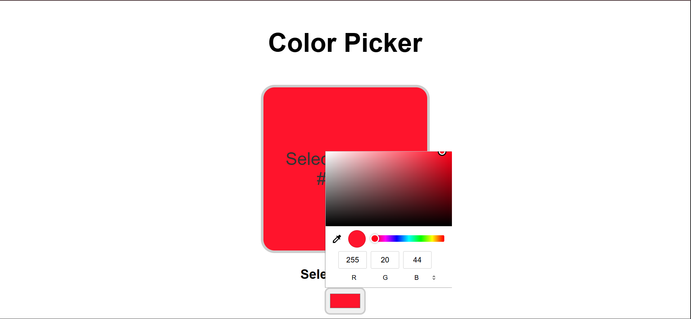
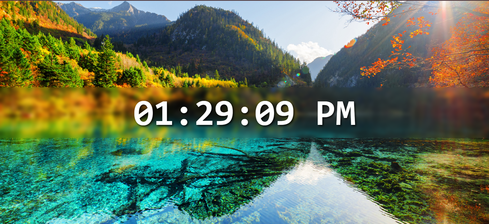
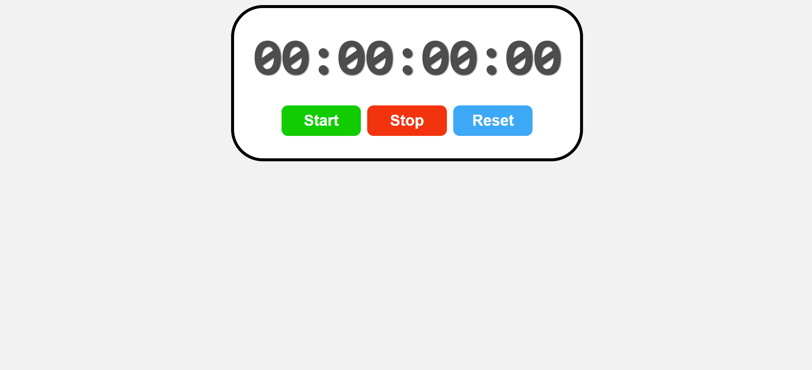
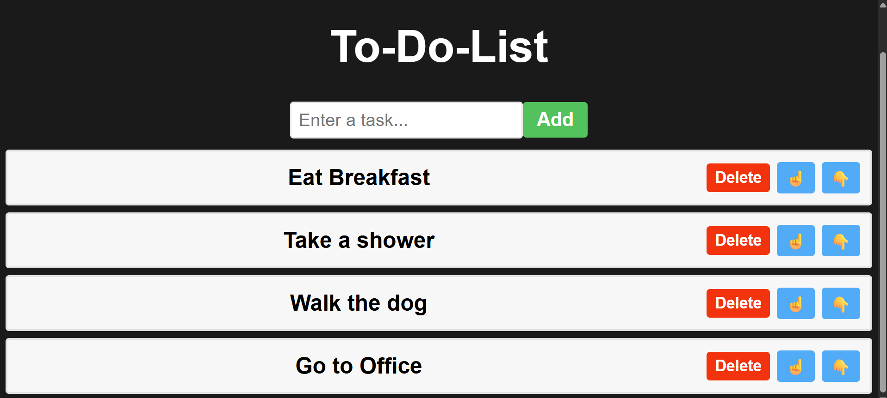

# React Mini Projects 🚀

A collection of simple yet interactive React projects to practice and showcase core concepts.  
Each project is built with **React Hooks**, **functional components**, and clean styling.  

## 📂 Projects Included
1. **Color Picker App**
2. **Digital Clock**
3. **Stopwatch**
4. **To-Do List App**

---

## 1️⃣ Color Picker App 🎨
**Description:**  
Pick any color using an interactive color picker, and see the selected color displayed instantly with its HEX code.  

**Features:**
- Real-time color preview
- Displays HEX, RGB values
- Simple and responsive UI

**Screenshot:**  


---

## 2️⃣ Digital Clock ⏰
**Description:**  
A real-time digital clock showing hours, minutes, and seconds with a beautiful background.  

**Features:**
- Live time update
- AM/PM format
- Background image styling

**Screenshot:**  


---

## 3️⃣ Stopwatch ⏱️
**Description:**  
A stopwatch application with Start, Stop, and Reset controls.  

**Features:**
- Start/Stop timer
- Reset functionality
- Millisecond precision
- Colorful control buttons

**Screenshot:**  


---

## 4️⃣ To-Do List App 📝
**Description:**  
A task manager app to add, delete, and reorder tasks for better productivity.  

**Features:**
- Add tasks
- Delete tasks
- Move tasks up or down
- Persistent state during session

**Screenshot:**  


---

## 🛠️ Installation & Usage
```bash
# Clone the repository
git clone https://github.com/your-username/your-repo-name.git

# Go into project folder
cd your-repo-name

# Install dependencies
npm install

# Run the app
npm start
